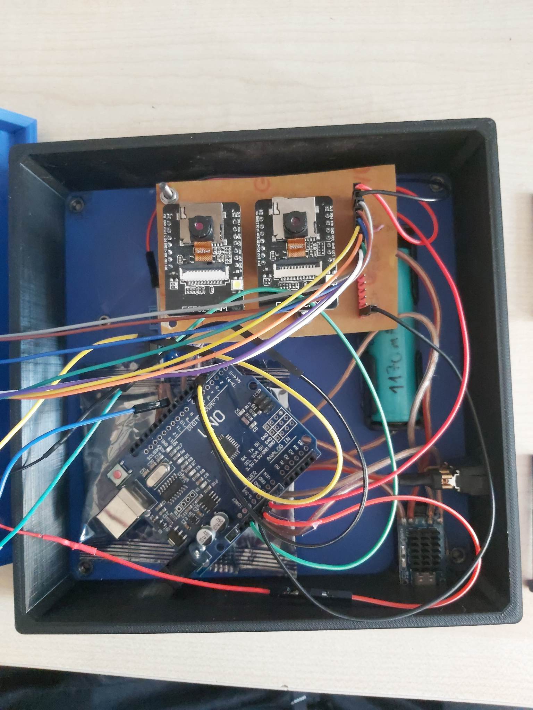
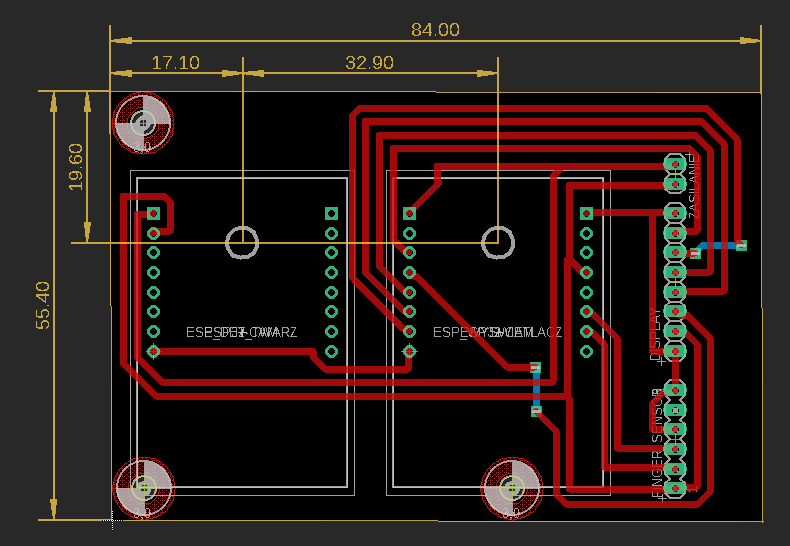

# IPZFingerprint-reader

## General info
This project is about vision system to control face, and fingerprint reader, which can be use for example in the gym's entrance.
## Parts of the project
- Casing
- Arduino UNO
- 2x ESP 32 cam modules
- LCD Display
- Power Supply
- PCB waffer
- Fingerprint reader

## Features
* Casing model

* Casing

* Electrical template

