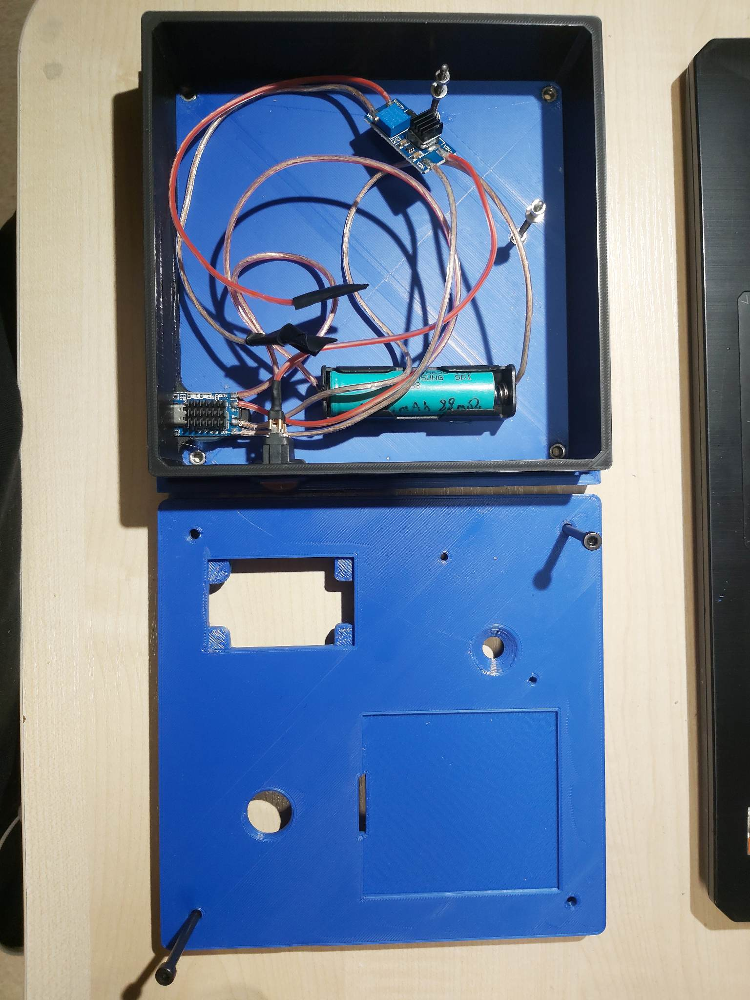
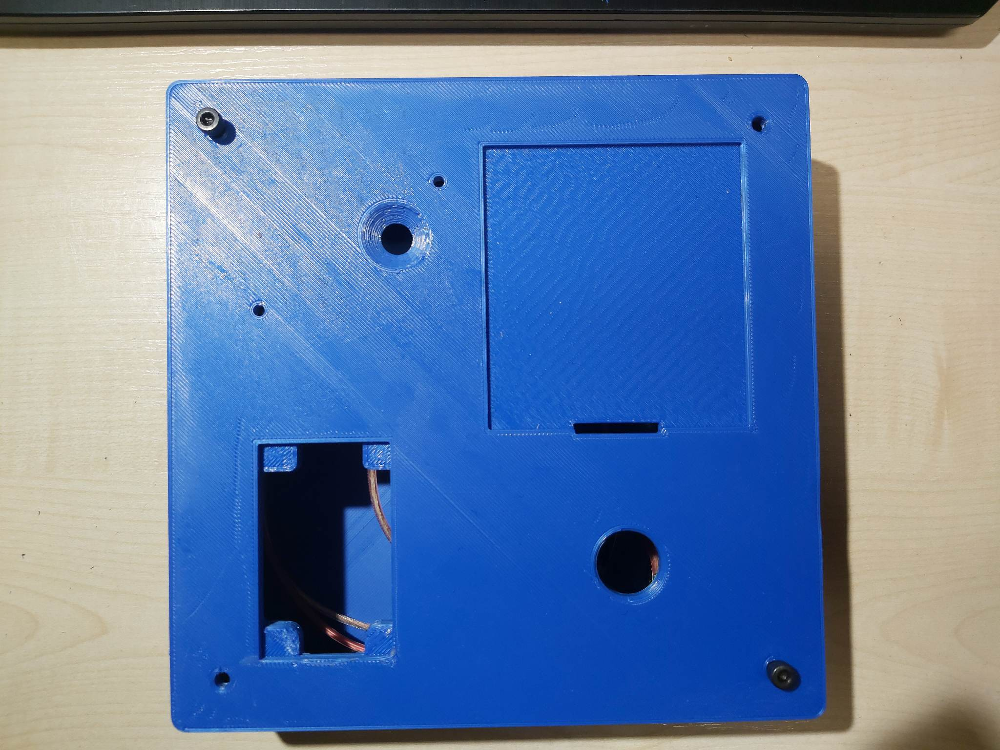
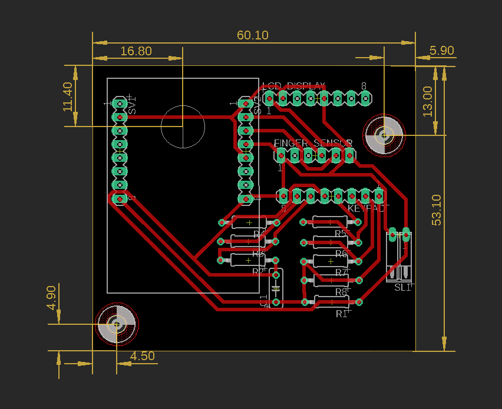

# IPZFingerprint-reader

## General info
This project is about vision system to control face, and fingerprint reader, which can be use for example in the gym's entrance.

## Features
* Casing model

* Casing

* Electrical template

