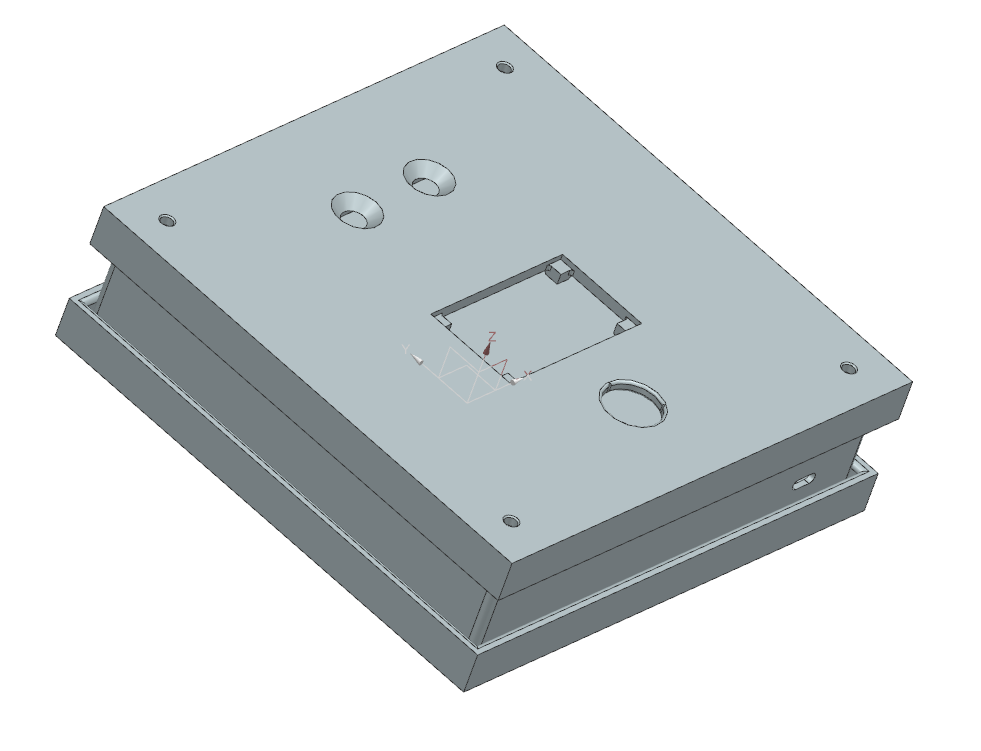
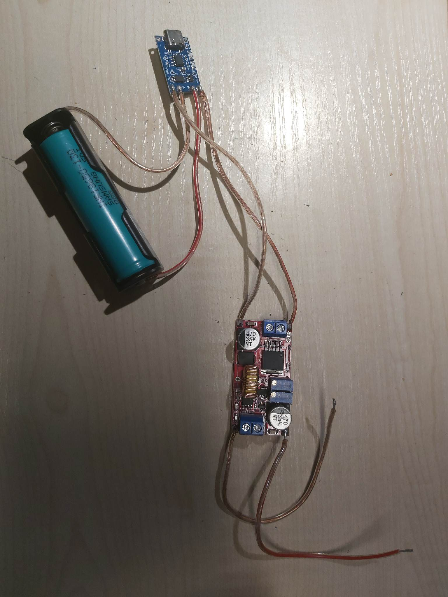

# IPZFingerprint-reader

## General info
This project is about vision system to control face, and fingerprint reader, which can be use for example in the gym's entrance.
Video in youtube about our project: https://www.youtube.com/watch?v=AcCnbSq9phA
## Parts of the project
- Casing was printed in 3D printer
- Arduino UNO
- 2x ESP 32 cam modules
- LCD Display
- Power Supply
- PCB waffer
- Fingerprint reader

## Features
* Casing model

* Casing

* Electrical template

* Power Supply

##Inscrutions of programming 
