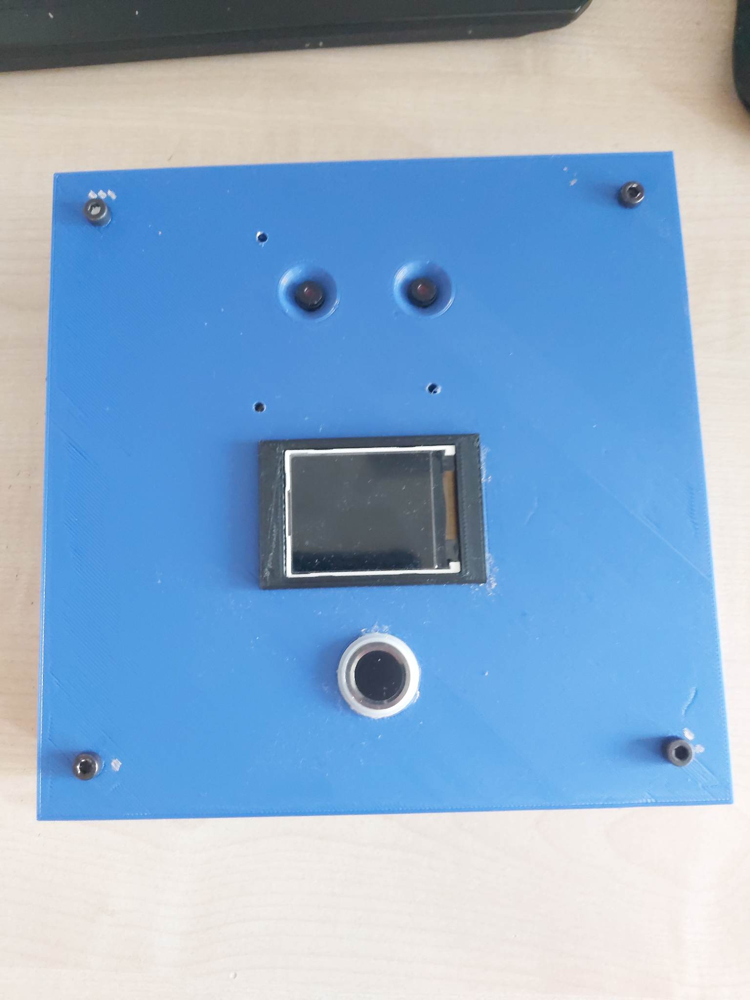

# IPZFingerprint-reader

## General info
This project is about vision system to control face, and fingerprint reader, which can be use for example in the gym's entrance.
Video in youtube about our project: https://www.youtube.com/watch?v=AcCnbSq9phA
## Parts of the project
- Casing was printed in 3D printer
- Arduino UNO
- 2x ESP 32 cam modules
- LCD Display
- Power Supply
- PCB waffer
- Fingerprint reader

## Features
* Casing model

* Casing

* Electrical template

* Power Supply

##Inscrutions of programming 
Programowanie ESP
Projekt posiada parę ESP32 CAM. Mikrokontroler po prawej służy do wyświetlania obrazu na wykorzystanym ekranie lewe natomiast ma za zadanie umożliwić rozpoznanie twarzy i przy pomyślnym zdetekowaniu wcześniej zapisanej twarzy wysłanie wiadomości o otwarciu drzwi.
Do programowania najlepiej posłużyć się dedykowanym shieldem

Podczas programowania proszę pamiętać o ustawieniu ESP do programowania, tzn. wykonać restart oraz zewrzeć I/O 0 z masą. Następnie należy włączyć program IPZ_detekcja_twarzy i zmienić informację o WiFi, do którego jest ma się podłączyć ESP
const char* ssid = "…………………………"; //Wifi Name SSID
const char* password = "………………………"; //WIFI Password
Proszę pamiętać, by WiFi, do którego będzie podłączone ESP było takie same jak to w laptopie/PC, by możliwe było otwarcie strony wygenerowanej przez ESP.
Po wgraniu programu należy włączyć Serial Monitor i odczytać link http stworzony przez ESP, jeśli nic się nie pojawi, to znaczy, że ESP wygenerował go szybciej – należy zrestartować mikrokontroler.
Link należy przekopiować do przeglądarki internetowej (podczas prac wynikło, że lepiej i szybciej ta strona działa na Microsoft Edge niż Google Chrome). Pojawia się strona z wieloma możliwościami ustawień obrazu ESP, natomiast nas interesują dwa umiejscowione najniżej – Face Detection oraz Face Recognition. Należy oba włączyć i w celu dodania twarzy do rozpoznawalnych nacisnąć przycisk ENROLL FACE.
Przygotowanie środowiska Arduino do programowania ESP oraz prezentacja krok po kroku wyżej opisanych etapów zaprezentowana jest tutaj: https://www.youtube.com/watch?v=U7qbehy9aDo
Programowanie Arduino
Jest ono prostsze niż ESP. Należy wejść w link https://wiki.dfrobot.com/Capacitive_Fingerprint_Sensor_SKU_SEN0348?fbclid=IwAR1N2KcrvW4JVnAKEWYYDCSp0KBrGGae08XXG-3g3vPN4EFn4t_vMVK6NwA#target_4
Podłączyć Arduino jak zaprezentowane jest poniżej

Następnie należy dodać bibliotekę ID809 Library załączoną na w/w stronie.
Ostatnim krokiem jest wgranie programu na Arduino, Sample Code 3-Add Fingerprints aby dodać kciuka, a następnie Sample Code 4-Fingerprint Matching by rozpoznawać dodane palce.
